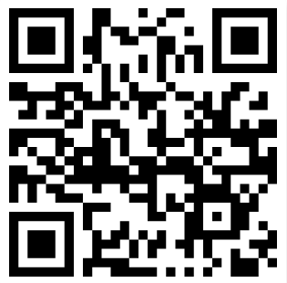

<!-- PROJECT LOGO -->
 

  

  <h3 align="center">Virtual Assist</h3>

  

    Virtual Assist will help the individual manage their medication, symptoms, medical appointments, and have a list of emergency contacts.
  

<!-- ABOUT THE PROJECT -->
## About The Project
Originally created with the idea of having a caretaker and patient relation. 

### Built With
* [Visual Studio Code](https://code.visualstudio.com/download)
* [React Native](https://reactnative.dev/docs/environment-setup)
* [Android Studio](https://developer.android.com/studio/?gclid=CjwKCAjwnPOEBhA0EiwA609ReYGN6Kaa7qHfg-ed7AcuRaHqu7bbVzBJN_HNkhziu4Ugp1sm0piqXRoC-ZgQAvD_BwE&gclsrc=aw.ds)
  * Emulator usage only

<!-- No Installation -->
## Easier Access Without Software
### Try it on your phone! Download Expo Go!
- Android
    - Download on Google Play Store
    - Open the app
    - Click on "Scan QR Code"
    - Point your camera directly on the QR Code
- iPhone
    - App Store
    - Go to your phone's camera
   

    
  

- Website
    - [Expo](https://snack.expo.io/@elikareyes/medical-aid-app)
